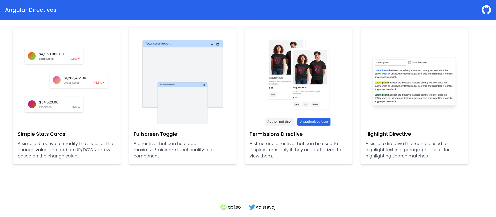
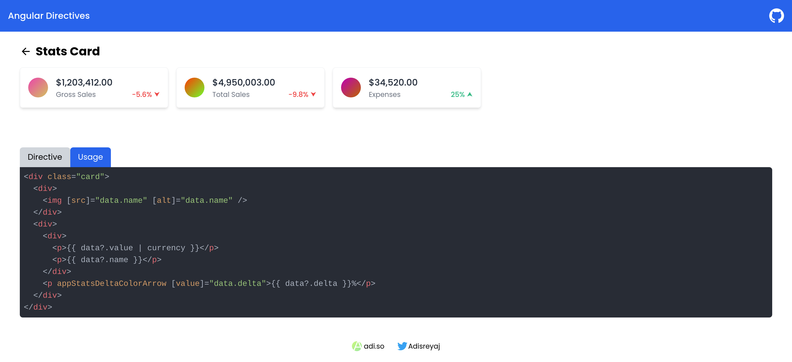

<h1 align="center">Angular Directive Showcase</h1>
<p align="center">
  
  
  
</p>

A collection of directives that can be used in different scenarios. See how to extract
away the extra logics from components to have a more maintainable and reusable code.



## Examples Showcased

1. Delta Value Arrow
1. Full-screen Toggle
1. Permission
1. Highlight Text
1. Long Press Directive
1. Badge Directive
1. Table Sort Directive

Each directive has a dedicated page where the code is also displayed.



---

## Run Locally

#### 1. Download or Clone the repository

```sh
git clone https://github.com/adisreyaj/angular-directives-showcase.git
```

#### 2. Install dependencies

```sh
npm install
```

#### 3. Run application

```sh
npm start
```

#### 4. Open the URL in browser

```
http://localhost:4200
```

---

## Support

Don't forget to ⭐ the repository if you like it.

 <a href="https://twitter.com/AdiSreyaj">
 
 </a>
 <br/>
 <a href="https://github.com/adisreyaj">

</a>
 <br/>
 <a href="https://www.linkedin.com/in/adithyasreyaj/">
 
</a>
 <br/>
 <a href="https://www.buymeacoffee.com/adisreyaj">
 
</a>
